# CrackGate.in — System Architecture (Executive Overview)

**Audience:** Leadership (CEO / VP / non-engineering stakeholders) and new engineers.
**Purpose:** Explain *what* we built, *how* it hangs together, and *why* it's safe, reliable, and cheap to run — without requiring a deep technical background.

> **One-line summary:** CrackGate is a paid online exam-prep platform built as a single modern web application on Amazon Web Services (AWS). It is fully automated — engineers ship changes by clicking "merge," and the system tests, builds, deploys, and health-checks itself.

---

## 1. The business in one picture

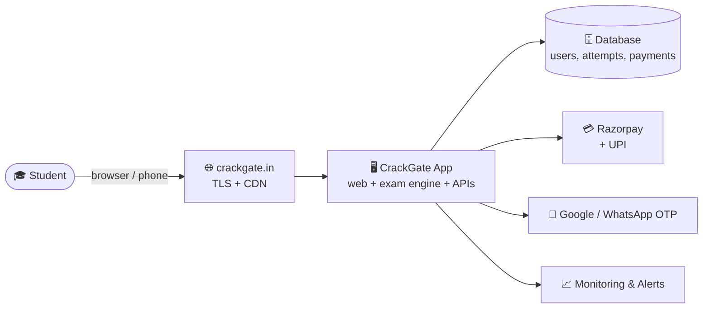

A student visits the site, signs in, takes mock tests in an exam simulator, pays
to unlock premium content, and gets analytics on their performance. Everything
behind that experience is the system described below.

---

## 2. What the product does (capabilities)

| Capability | What the user sees | Why it matters commercially |
| ---------- | ------------------ | --------------------------- |
| **Exam simulator** | A pixel-accurate clone of the real government (NTA) test interface — timer, question palette, mark-for-review, auto-submit | Core differentiator; students train in exam conditions |
| **Mock tests & practice** | Full-length mocks + 900+ topic-wise questions with solutions | The thing people pay for |
| **Server-graded results** | Instant, tamper-proof scores + subject-wise SWOT analytics | Trust + stickiness |
| **Multiple exam tracks** | GATE (Mining + more branches), PSU, State, Diploma | Expands the addressable market |
| **Payments** | Razorpay card/UPI + a manual UPI fallback | Direct revenue |
| **Accounts** | Sign in with Google or a WhatsApp OTP | Low-friction onboarding for Indian users |

---

## 3. The four layers of the system

The whole platform is organised into four layers. Each is explained below in
plain terms, then with the technical detail an engineer needs.

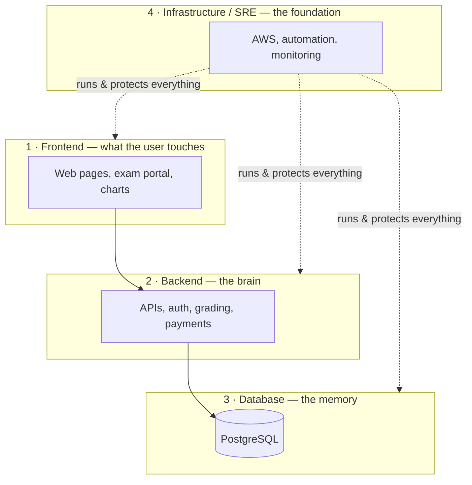

---

### Layer 1 — Frontend (what the user touches)

**In plain terms:** the website itself — every page and the interactive exam screen.

- Built with **Next.js 15 / React 19** (the same framework family used by companies
  like TikTok, Notion, and Hulu) and styled with **Tailwind CSS**.
- The standout piece is the **exam portal** — a faithful simulation of the official
  NTA test interface (question palette, mark-for-review, countdown timer with
  auto-submit). This is what makes students feel "exam-ready."
- Rich **analytics dashboards** (score trends, percentile, time-per-question,
  strengths/weaknesses) are drawn with charting libraries; math/formulas render
  cleanly via KaTeX.
- Works equally on desktop and mobile.

> **Engineer detail:** App Router under `apps/web/src/app/*` (home, `gate/*`, `practice`,
> `mocks`, `pyq`, `aits`, `psu`, `state`, `diploma`, `pricing`, `pay`, `dashboard`,
> `admin`, legal pages). Exam logic in `apps/web/src/components/exam-portal.tsx`.
> ~40 React components; charts via Recharts, animation via Framer Motion.

---

### Layer 2 — Backend (the brain)

**In plain terms:** the logic that runs on our servers — the part users *can't* see
or tamper with. This is where trust and money are handled.

- **Authentication** — sign-in via **Google** or a **WhatsApp one-time code**. Sessions
  are secure tokens; passwords (where used) are cryptographically hashed.
- **Grading runs on the server, never the browser.** A student cannot fake a score by
  editing their browser — the result is computed by us and stored. This protects the
  integrity of rankings and percentiles.
- **Payments are verified, not trusted.** When someone pays, Razorpay sends us a
  **digitally signed** confirmation; only that signed message can unlock a paid plan.
  There is no way for a user to "self-upgrade."
- A lightweight **health endpoint** lets our automation continuously confirm the app
  is alive and connected to the database.

> **Engineer detail:** API route handlers under `apps/web/src/app/api/*`
> (`auth/[...nextauth]`, `attempts`, `practice`, `mocks`, `analytics`, `razorpay/order`,
> `razorpay/webhook`, `pay/upi/submit`, `admin`, `healthz`). Auth = NextAuth v5
> (`lib/auth.ts` + edge-safe `lib/auth.config.ts`). Grading in `lib/grading.ts`
> (GATE marking incl. negative marks; MCQ/MSQ/NAT), numeric matching in `lib/nat.ts`.
> Razorpay webhook verifies HMAC-SHA256 before writing to the DB.

---

### Layer 3 — Database (the memory)

**In plain terms:** the secure record of everything — who the users are, every test
they've taken, and every payment.

- A managed **PostgreSQL** database (industry-standard, the same engine used by
  Instagram, Spotify, and Robinhood), run by AWS so we don't manage servers.
- Stores users, their **entitlements** (which exam tracks they've paid for), every
  **attempt** (score, breakdown, answers), **payments**, and OTP codes.
- **Backed up automatically every night**, with point-in-time recovery from AWS.

> **Engineer detail:** Prisma schema in `packages/database` (client `@crackgate/database`).
> Key models: `User`, `Entitlement` (per exam/subject tier), `Attempt`, `Payment`,
> `UpiPayment`, `Activity`, `OtpCode`, plus NextAuth `Account`/`Session`. Connection
> pooling via **pgbouncer**; migrations run against a direct URL for safety.

---

### Layer 4 — Infrastructure / SRE & DevOps (the foundation)

**In plain terms:** the servers, the automation that ships code safely, and the alarms
that wake someone up if something breaks. This is the discipline that keeps a paid
product trustworthy.

- **Everything runs on AWS** in the Mumbai region (data stays in India).
- **Infrastructure as code** — the entire cloud setup is defined in **Terraform** text
  files. We can rebuild the whole platform from scratch, and there are **two identical
  environments**: production (real users) and staging (a safe testing copy).
- **Automated, self-checking deployments** — when an engineer merges a change, a robot
  (GitHub Actions) runs the tests, builds the app, deploys it, and **automatically rolls
  back if the new version is unhealthy**. No manual server logins.
- **Always-on monitoring** — uptime checks, error tracking, and CPU/database alarms
  notify us before users notice.
- **Secure by default** — automatic HTTPS encryption, secrets stored in an encrypted
  vault, and the cloud login uses short-lived keys instead of permanent passwords.

> **Engineer detail:** Terraform in `infra-tf/` (network, compute, rds, iam, storage,
> alerts, uptime) + `infra-tf/staging/`. Compute = EC2 `t4g.small` (ARM64) with Docker
> Compose + Caddy (auto-TLS) + pgbouncer. CI/CD in `.github/workflows/deploy.yml`
> (main→prod) and `deploy-staging.yml` (develop→staging). Images in ECR, secrets in
> Secrets Manager, monitoring via CloudWatch + Route 53 + Sentry.

---

## 4. How a change reaches users (the deployment pipeline)

This is the part leadership usually cares about most: **how do we ship safely and fast?**

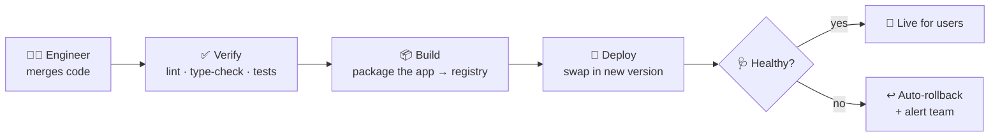

1. **Verify** — code is automatically linted, type-checked, and unit-tested. Broken code never proceeds.
2. **Build** — the app is packaged into a container image and stored in AWS's private registry.
3. **Deploy** — the new version is swapped in with **zero downtime**.
4. **Health gate** — the system checks the new version is actually serving traffic; if not, it **rolls back automatically** and alerts the team. After production deploys, a real browser test (Playwright) visits the live site to confirm key pages work.

**Why this matters:** releases are routine and low-risk. A bad change is caught by the
robot, not by a paying customer.

---

## 5. Reliability, security & cost — the leadership scorecard

| Concern | How it's addressed |
| ------- | ------------------ |
| **Uptime** | External health checks every 30s + automatic rollback on bad deploys + alarms |
| **Data safety** | Managed PostgreSQL with nightly backups + point-in-time recovery; uploads/backups in versioned S3 |
| **Payment integrity** | Plans unlock *only* via a cryptographically signed Razorpay confirmation — no client-side bypass |
| **Result integrity** | Grading happens on our servers; scores can't be forged in the browser |
| **Security** | Automatic HTTPS, encrypted secrets vault, short-lived cloud credentials (OIDC), least-privilege access |
| **Recoverability** | Whole platform defined in code (Terraform) — reproducible and version-controlled |
| **Cost** | Single right-sized AWS server + managed DB; staging auto-stops nightly to save money. Runs in the **low tens of dollars per month** at current scale |
| **Data residency** | All infrastructure in AWS Mumbai (`ap-south-1`) — data stays in India |

---

## 6. Why this architecture (the strategic rationale)

- **Lean by design.** One application, one server, one managed database — no expensive
  Kubernetes cluster or sprawling microservices we don't yet need. We pay for
  simplicity now and can scale up *in place* later.
- **Enterprise-grade discipline at startup cost.** Automated testing, zero-downtime
  deploys, auto-rollback, monitoring, and a separate staging environment are practices
  usually seen at much larger companies — here they cost almost nothing because they're
  automated and code-defined.
- **Built to grow.** New exam tracks (already structured for GATE branches, PSU, State,
  Diploma) plug into the same engine. Scaling up is changing one setting, not a rewrite.
- **Trust is the moat.** For a paid exam product, credible scores and reliable payments
  are the product. The architecture protects both at the foundation.

---

## 7. Deep dive — technical flows & diagrams

> This section is for engineers and technically-curious stakeholders. It traces the
> real request paths, security boundaries, and data flows in detail. Leadership can
> safely skim the diagram captions.

### 7.1 Network & infrastructure topology

How the AWS pieces physically fit together inside the Mumbai region.

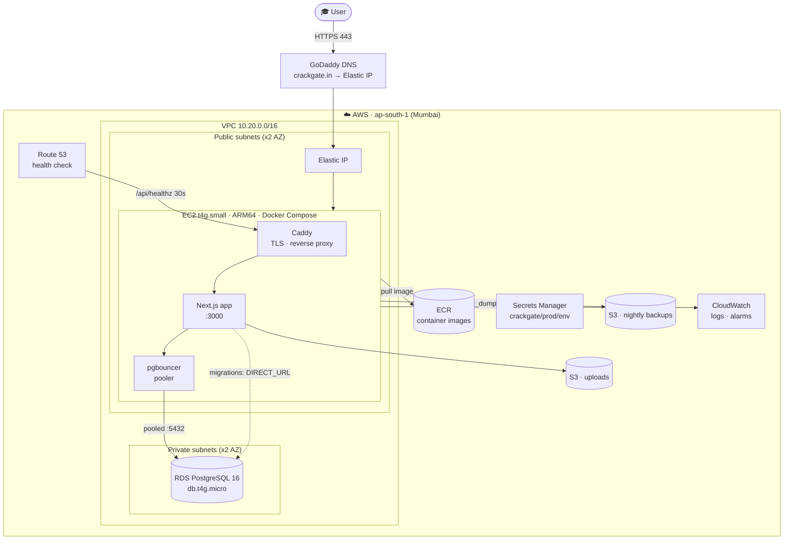

**Security boundaries:** the database lives in **private subnets** with no public
route — only the app (via pgbouncer) can reach it. Inbound traffic to the box is
limited to ports 80/443. Secrets never sit in the repo; the instance reads them from
Secrets Manager at boot using its IAM role.

---

### 7.2 Anatomy of a single request

What happens between a click and a rendered page.

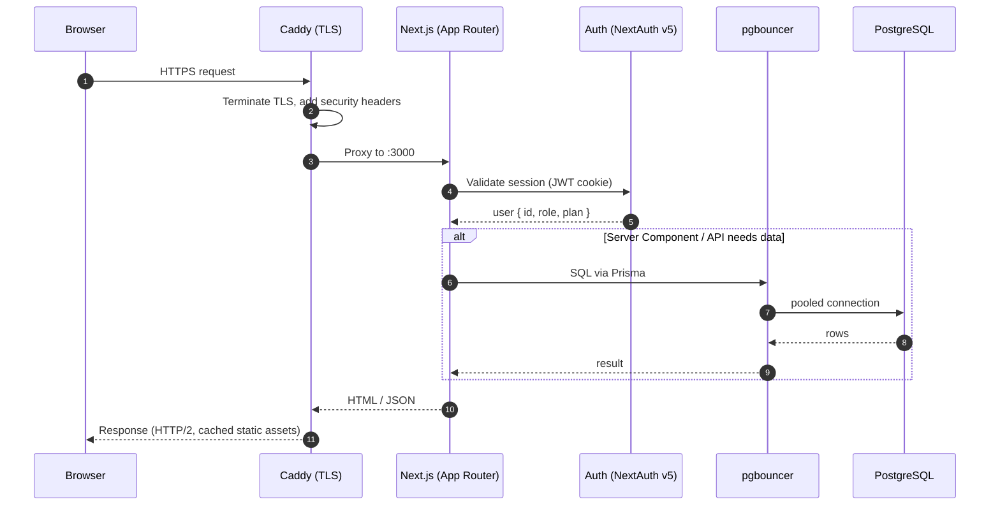

Static assets (`/_next/static/*`, favicons) are served with long-cache immutable
headers, so repeat visits are fast and cheap.

---

### 7.3 Authentication flows

Two sign-in paths share one session model. Passwords (dev/credentials) are bcrypt-hashed;
production users use Google or a WhatsApp one-time code.

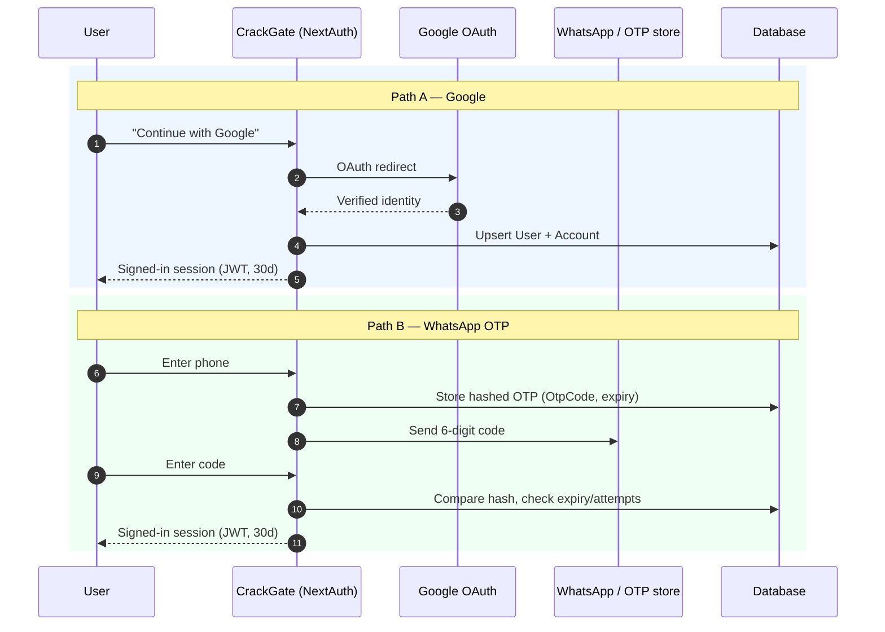

The session is a **signed JWT** carrying `id`, `role`, and `plan`, so the edge
middleware can authorize pages without a database hit on every request.

---

### 7.4 Payment & entitlement flow (the money path)

The critical rule: **a plan unlocks only when a cryptographically signed webhook
confirms the payment** — the browser is never trusted.

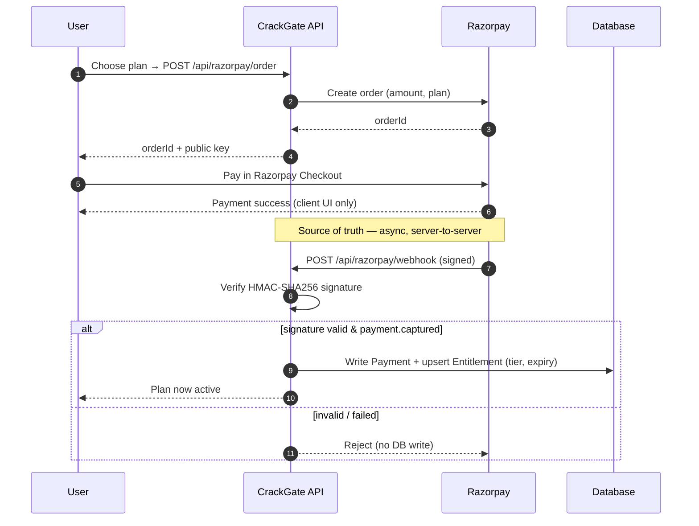

A **manual UPI fallback** exists (`UpiPayment`, status `pending` → admin approves)
for users who pay outside the gateway — useful early, and fully auditable.

---

### 7.5 Exam attempt & server-side grading

Why scores can't be faked: the browser only submits *answers*; the **server computes
the score** and stores the authoritative record.

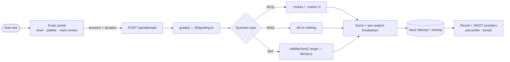

The same `natMatches()` logic powers both grading and the client review screen, so
what the student sees always matches what was scored.

---

### 7.6 Data model (entity relationships)

The core records and how they connect.

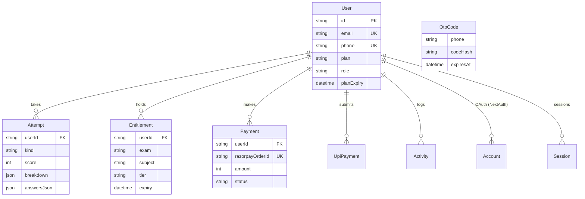

`Entitlement` is what lets a single user own **multiple exam tracks** (GATE + PSU +
State…) independently — the key to expanding the product without schema rewrites.

---

### 7.7 CI/CD deployment — the detailed sequence

The "merge → live" pipeline, with the safety gates that make releases boring.

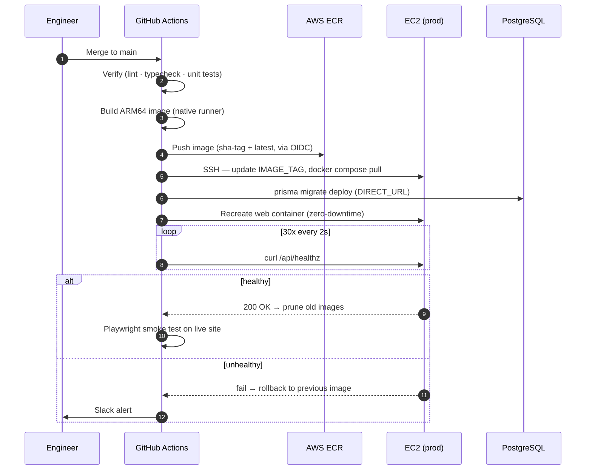

**No human SSHes to deploy.** Cloud access uses short-lived OIDC tokens (no stored
AWS keys), migrations run before the swap, and a failed health check rolls back
automatically. Staging follows the same pipeline from the `develop` branch.

---

### 7.8 Observability — how we know it's healthy

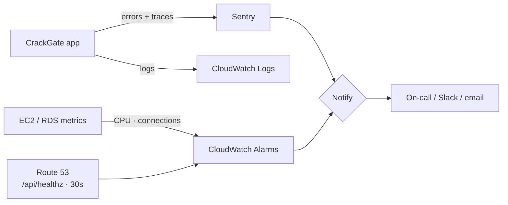

Three independent signals — **errors** (Sentry), **infrastructure** (CloudWatch),
and **end-to-end uptime** (Route 53) — mean a problem is detected from multiple
angles before users feel it.

---

## 8. Where to go deeper

| Topic | Document |
| ----- | -------- |
| Project overview & local setup | [README.md](README.md) |
| How we deploy (AWS, CI/CD, break-glass) | [DEPLOY.md](DEPLOY.md) |
| The staging environment | [STAGING.md](STAGING.md) |
| Go-live checklist | [LAUNCH_CHECKLIST.md](LAUNCH_CHECKLIST.md) |

---

*Prepared as a non-technical-friendly overview of the CrackGate.in platform. For a
component-by-component technical reference, see the source under `apps/web`,
`packages/database`, and `infra-tf`.*
