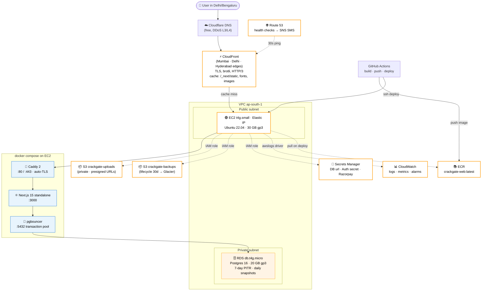
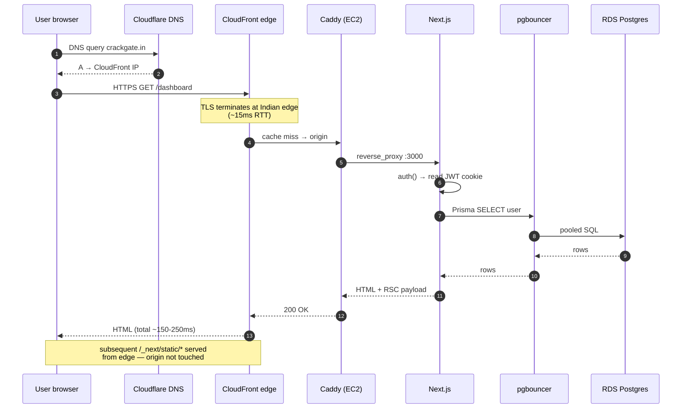
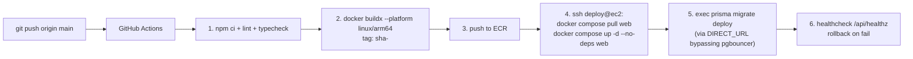

# CrackGate — Production Architecture (AWS)

Target: **200 users**, **~$32/mo**, **p95 page load < 1.5s** for Indian users,
**zero-downtime deploys**, no AWS-only lock-in beyond EC2/RDS endpoints.

## High-level diagram

## Request lifecycle

## Deploy pipeline

## Why each component exists

| Component | Role | What breaks without it |
|---|---|---|
| **Cloudflare DNS** | Resolve `crackgate.in` to CloudFront. Free DDoS L3/L4 shield. | Site goes down during DNS-level attacks |
| **CloudFront** | TLS termination at Indian edges, cache `/_next/static`, brotli, HTTP/3 | p95 +600ms latency, all egress hits origin |
| **EC2 t4g.small** | Runs `docker compose` with Caddy + Next.js + pgbouncer | No app server |
| **Caddy** | Auto Let's Encrypt cert, reverse proxy, HSTS, rate-limit | Manual cert renewal, no HTTP/3 |
| **Next.js (standalone)** | Server components, server actions, NextAuth, API routes | No app |
| **pgbouncer** | Multiplex 200 client conns → 20 RDS conns | "too many connections" 500s on bursts |
| **RDS Postgres** | Source of truth: users, attempts, payments, NextAuth sessions | Total data loss potential |
| **S3 uploads** | User PDFs via presigned URLs — bytes bypass EC2 | EBS fills up, app slows |
| **S3 backups** | Nightly `pg_dump.sql.gz` with 30-day → Glacier lifecycle | RDS PITR + manual snapshots only — no off-engine recovery |
| **ECR** | Private Docker registry for the prod image | Slow deploys (build on box), no rollback to prior image |
| **Secrets Manager** | Stores `DATABASE_URL`, `AUTH_SECRET`, Razorpay keys | Secrets sit in `.env` on disk |
| **CloudWatch** | Logs via `awslogs` driver, EC2/RDS metrics, alarms | Blind to outages until users complain |
| **Route 53** | Health check `/api/healthz` every 30s → SNS SMS | No proactive outage detection |

## Capacity check (200 users)

| Resource | Limit | Expected peak | Headroom |
|---|---|---|---|
| EC2 CPU | 2 vCPU | ~5% (Next.js handles ~200 req/s) | 20× |
| EC2 RAM | 2 GB | ~900 MB (web + Caddy + pgbouncer + Docker overhead) | 2.2× |
| EBS IOPS | 3000 baseline | <50 | 60× |
| RDS connections | 85 | 20 (via pgbouncer) | 4× |
| RDS storage | 20 GB | <2 GB | 10× |
| CloudFront free tier | 1 TB egress | ~30 GB | 33× |
| CloudWatch free tier | 5 GB logs | ~1 GB | 5× |

**Verdict**: stack runs at <10% utilization. You're buying margin and reliability, not capacity.

## Cost — $32/mo itemized

| Item | $/mo | Notes |
|---|---|---|
| EC2 t4g.small on-demand | 14 | drops to ~$10 with 1-yr RI |
| 30 GB gp3 EBS | 2.40 | |
| RDS db.t4g.micro Postgres 16 | 13 | single-AZ |
| RDS backups (under DB size) | 0 | free up to DB size |
| CloudFront | ~1 | within free tier most months |
| Route 53 hosted zone | 0.50 | |
| Secrets Manager (3 secrets) | 1.20 | $0.40/each |
| S3 uploads + backups (~10 GB) | 0.50 | Standard + Glacier lifecycle |
| Data transfer out (~30 GB) | ~1 | most absorbed by CloudFront cache |
| CloudWatch logs | 0–1 | 5 GB free |
| **Total** | **~$32** | **~6 months on $200 credits** |

With 1-year EC2 RI + 3-year RDS RI applied: **~$24/mo → ~8 months runway**.

## Scaling triggers

| Trigger | Action | Cost delta |
|---|---|---|
| 1,000 DAU | RDS retention → 14 days | $0 |
| 2,000 DAU | EC2 → t4g.medium | +$7 |
| 5,000 DAU | 2× EC2 + ALB + multi-AZ RDS | +$45 |
| 10,000 DAU | ECS Fargate + RDS Proxy | +$80 |
| Enterprise pilot | WAF + GuardDuty + AWS Backup | +$15 |

No re-architecture: same Docker image runs on ECS, same Prisma schema on Aurora.

## Related files

- [Dockerfile](../Dockerfile) — multi-stage build, ARM64-compatible
- [docker-compose.aws.yml](../docker-compose.aws.yml) — production stack for EC2 (pgbouncer + ECR pull + awslogs + nightly backup)
- [docker-compose.yml](../docker-compose.yml) — Contabo / single-host variant (Postgres in-compose)
- [Caddyfile](../Caddyfile) — reverse proxy, TLS, security headers
- [infra/lib/data-stack.ts](../infra/lib/data-stack.ts) — CDK for Aurora Serverless v2 (future scale target, not in use yet)
- [apps/web/src/app/api/healthz/route.ts](../apps/web/src/app/api/healthz/route.ts) — Route 53 + Caddy health probe
